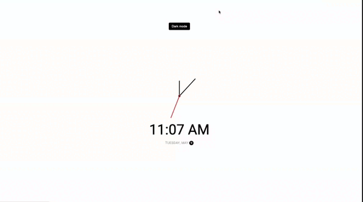

# Theme Clock 🕚

The Theme Clock Project is a clock application that provides a visually appealing way to display the time, including hour, minute, and second needles, along with digital hour and AM/PM indicator. Additionally, it features a dark mode option and displays the current date.

## Features

- **Analog Clock**: The clock showcases hour, minute, and second needles, providing a classic and elegant representation of time.

- **Digital Hour**: Alongside the analog display, the digital hour is prominently shown, making it easy to read the time at a glance.

- **AM/PM Indicator**: The clock indicates whether it is morning (AM) or afternoon/evening (PM), ensuring accurate time representation.

- **Dark Mode**: The clock includes a dark mode option for users who prefer a darker color scheme. This option enhances readability in low-light conditions and adds a touch of sophistication to the interface.

- **Current Date**: The clock also displays the current date, allowing users to quickly reference the day, month, and year.

## Usage

To use the Theme Clock Project, simply open the index.html file in a web browser. The clock will be displayed on the screen with the current time and date.

## Dark Mode

To enable the dark mode, click on the toggle button located on the clock interface. This will switch the color scheme to a darker theme, which can be visually appealing and easier on the eyes in low-light environments.

## Dependencies

The Theme Clock Project doesn't rely on any external libraries or frameworks. It is built using HTML, CSS, and JavaScript, making it lightweight and easy to integrate into any web-based project.

## Contributing

Contributions to the Theme Clock Project are welcome! If you have any suggestions, bug reports, or improvements, please feel free to submit an issue or create a pull request on the project's GitHub repository.

## Acknowledgments

The Theme Clock Project was inspired by the concept of combining analog and digital clock displays into a visually pleasing design. Special thanks to the contributors and open source projects that helped make this project possible.
